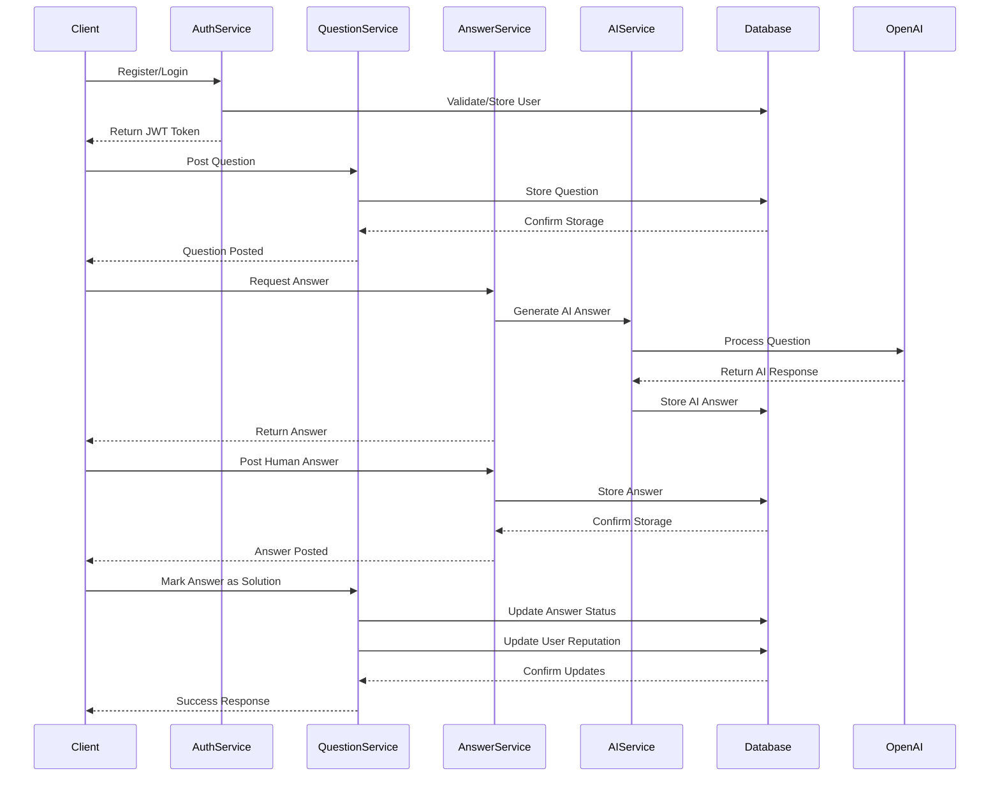

```mermaid
sequenceDiagram
    participant Client
    participant AuthService
    participant QuestionService
    participant AnswerService
    participant AIService
    participant Database
    participant OpenAI

    %% Authentication Flow
    Client->>AuthService: Register/Login
    AuthService->>Database: Validate/Store User
    AuthService-->>Client: Return JWT Token

    %% Question Flow
    Client->>QuestionService: Post Question
    QuestionService->>Database: Store Question
    Database-->>QuestionService: Confirm Storage
    QuestionService-->>Client: Question Posted

    %% Answer Flow with AI
    Client->>AnswerService: Request Answer
    AnswerService->>AIService: Generate AI Answer
    AIService->>OpenAI: Process Question
    OpenAI-->>AIService: Return AI Response
    AIService->>Database: Store AI Answer
    AnswerService-->>Client: Return Answer

    %% User Interaction
    Client->>AnswerService: Post Human Answer
    AnswerService->>Database: Store Answer
    Database-->>AnswerService: Confirm Storage
    AnswerService-->>Client: Answer Posted

    %% Reputation Update
    Client->>QuestionService: Mark Answer as Solution
    QuestionService->>Database: Update Answer Status
    QuestionService->>Database: Update User Reputation
    Database-->>QuestionService: Confirm Updates
    QuestionService-->>Client: Success Response
```
